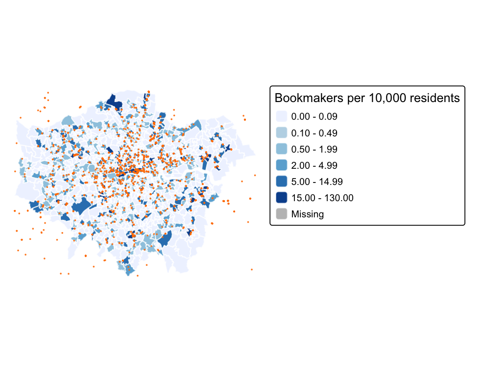
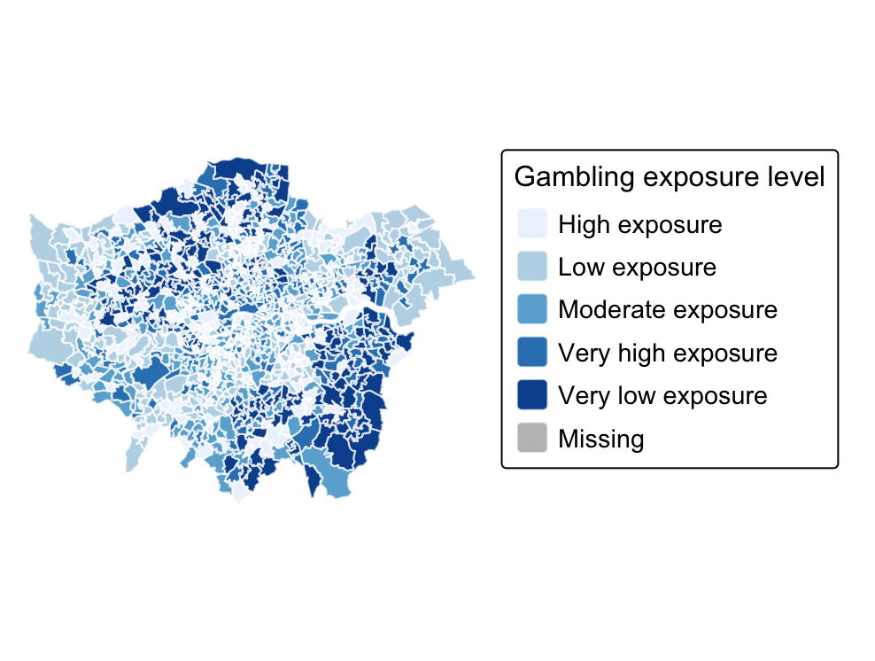
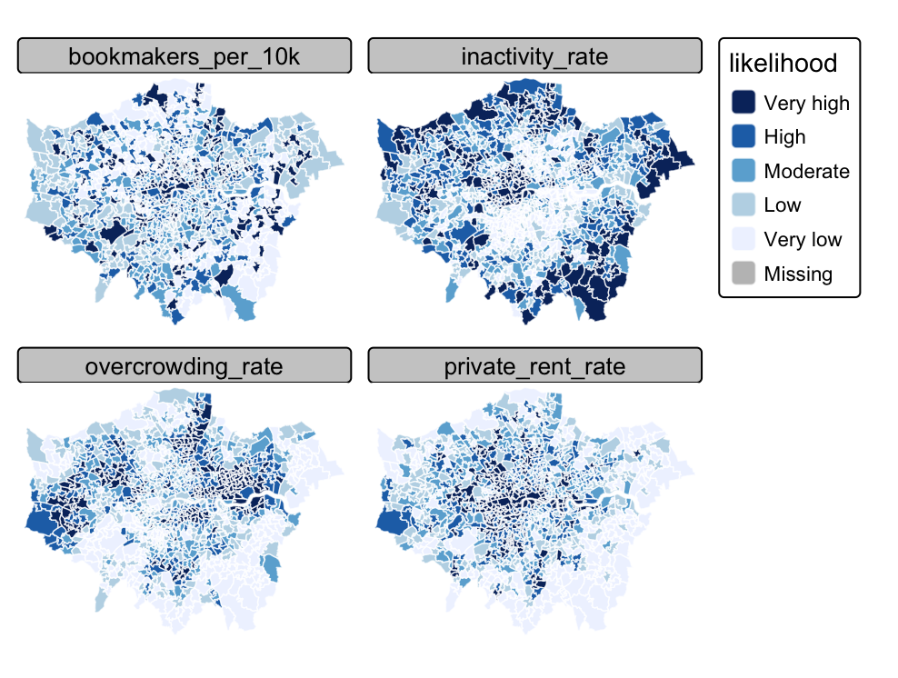

[English](qm-gambling.qmd){.language-button}

## 项目概述

该项目研究伦敦不同社区博彩店的空间分布，并分析博彩暴露是否与社会经济和住房脆弱性相关。项目使用每 10,000 名居民对应的博彩店数量作为社区暴露指标，并与失业、经济不活跃、住房拥挤和私人租赁等指标进行比较。

[查看完整报告](coursework/qm-gambling/gambling-exposure-london.pdf){target="_blank"}

## 研究问题

- 伦敦博彩店在社区尺度上分布有多不均衡？
- 经济压力或住房压力较高的地区是否面临更高博彩暴露？
- 哪些社区变量最能预测每 10,000 名居民对应的博彩店数量？
- 博彩暴露与社会脆弱性如何形成累积空间风险？

## 方法

- OpenStreetMap 博彩与 bookmaker 数据提取。
- 2021 年 Greater London MSOA 边界。
- 2021 年英国人口普查社区指标。
- 点面空间连接。
- 人口标准化暴露指标。
- 回归建模与空间可视化。
- 累积风险制图。

## 代表输出

## 主要发现

伦敦博彩暴露高度不均衡。许多社区没有博彩店，而少数中心区与东伦敦社区暴露较高。私人租赁与经济不活跃与博彩暴露之间的关联最明显，说明博彩环境与住房及劳动力市场压力相关。

该项目将博彩视为空间不平等问题，而不仅是个人行为问题，并指出地方规划、许可与分区政策会影响居民日常接触博彩环境的程度。

[返回课程作品](coursework-zh.qmd)
