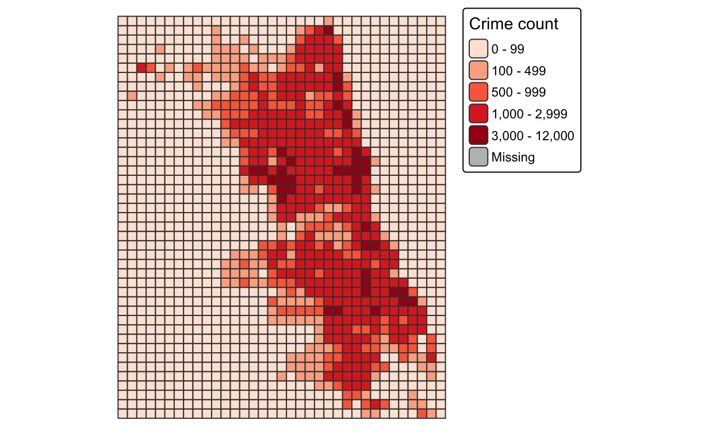
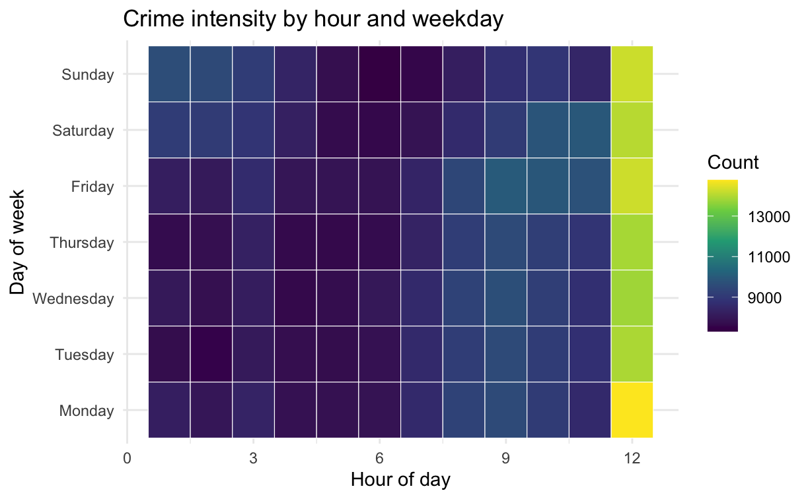
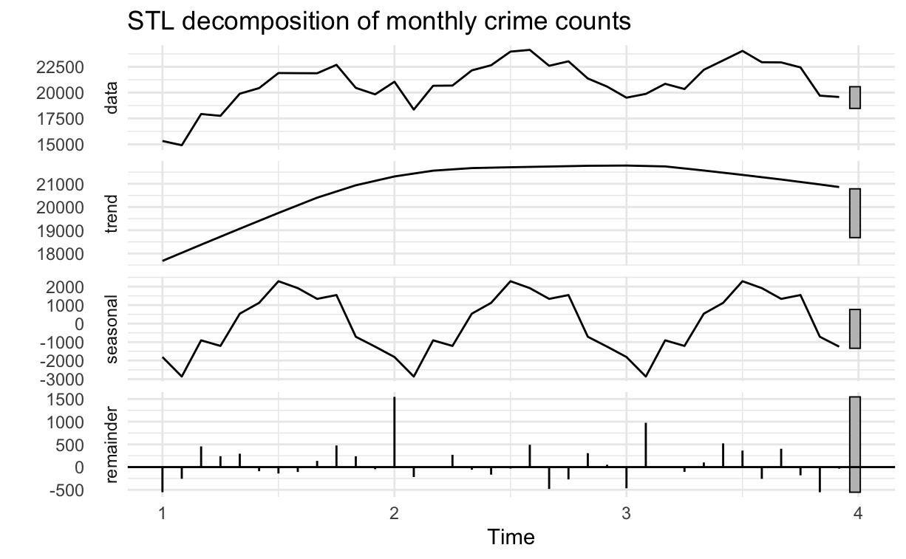
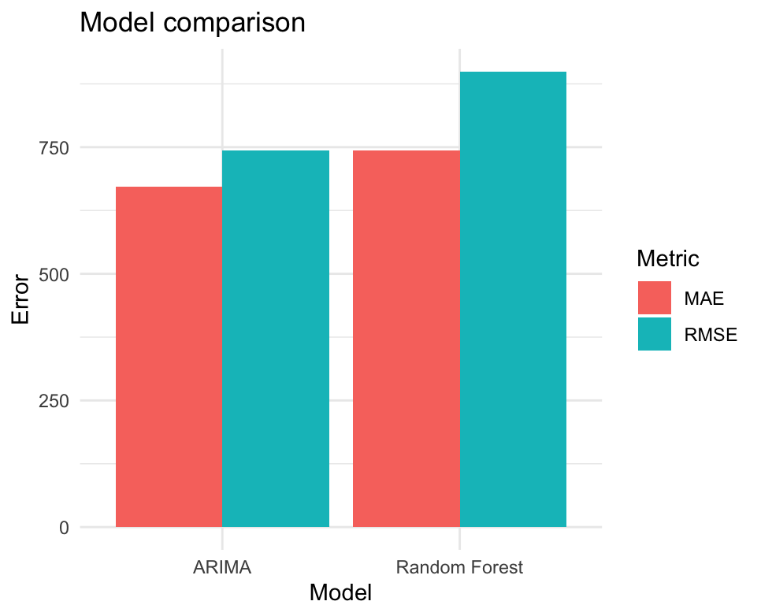

[English](stdm-chicago-crime.qmd){.language-button}

## 项目概述

该项目分析 2022 至 2024 年芝加哥报告犯罪事件，结合探索性时空分析、预测模型与机器学习，理解犯罪热点、时间变化与短期预测表现。

[查看完整报告](coursework/stdm-chicago-crime/chicago-crime-stdm-report.pdf){target="_blank"}

## 研究问题

- 芝加哥犯罪事件主要集中在哪些空间区域？
- 2022、2023 与 2024 年热点是否持续存在？
- 犯罪数量如何按月份、星期、日期与小时变化？
- 机器学习模型是否能优于传统时间序列模型？

## 方法

- 2022 至 2024 年芝加哥公共犯罪记录。
- 空间清洗与坐标验证。
- 月度与周度时间序列聚合。
- STL 分解与平稳性检验。
- 网格尺度空间聚合。
- Global Moran's I 与 Local Indicators of Spatial Association。
- ARIMA、SARIMA、朴素基线与随机森林预测。
- 使用 RMSE 与 MAE 评估模型表现。

## 代表输出

## 主要发现

犯罪事件呈现明显空间聚集，热点持续出现在芝加哥中心区、西部与南部部分区域。时间上，犯罪在温暖月份、傍晚与周末更为集中。

在预测任务中，随机森林优于朴素基线、ARIMA 与 SARIMA，说明经过设计的时间特征能够更好捕捉短期波动。

[返回课程作品](coursework-zh.qmd)
